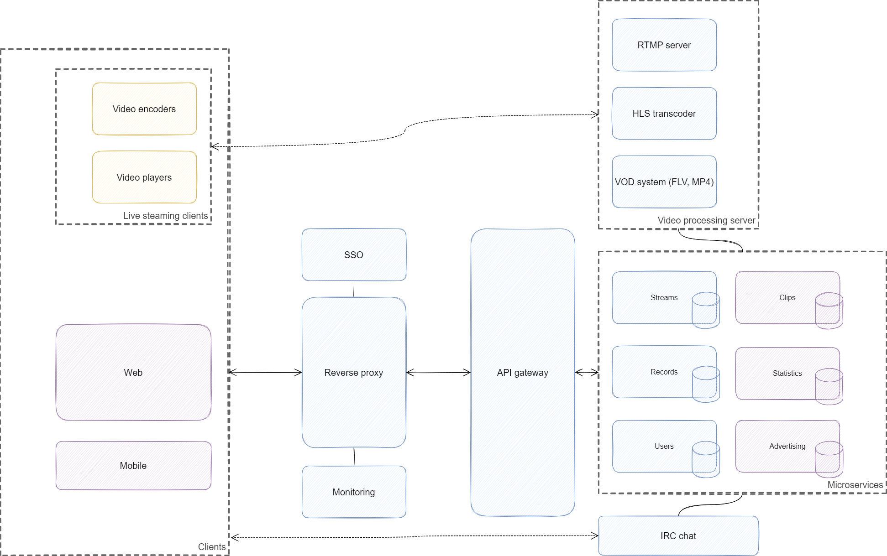

# Разработка видеостримигового сервиса. Современный подход к разработке веб-сервисов

## План

### Целевая установка

Изучение технололгий и протоколов, необходимых для организации видео трансляций.
Поиск новых инструментов и лучших практик для решения привычных задач.
Разработка серверной части видеостримингового сервиса с применением полученных знаний.

### Содержание

- [Технологии видео](#технологии-видео) _(теоритическая часть)_
    - видеоформаты, видеоконтейнеры, видео- и аудиокодеки
    - онлайн трансляция: загрузка видео, транскодирование, распространение; VoD система
    - H5 (HTML5) видео
- [Выбор целевого решения](#выбор-целевого-решения) _(обзорная часть)_
    - анализ успешных видеостримиговых сервисов
    - анализ стримиговых клиентов: приложения для трансляции и видеоплееры
- [Архитектура, инфраструктура и технологии](#архитектура-инфраструктура-и-технологии) _(обзор, сравнение и выбор)_
    - микросервисная архитекура - сравнение с другими архитектурами. Выделение сервисов
    - технологии: СУБД, MQ, кэш, API, обратный прокси (reverse proxy), SSO, наблюдаемость (observability), контейнеризация (и, возможно, оркестрация)
- [Реализация](#реализация) _(практическая часть)_
    - сервер обработки видео
    - микросервисы и API шлюз
    - _IRC протокол и чат (возможно)_
    - инфраструктура: обратный прокси сервер, SSO, мониториг (метрики и логирование)

#### Технологии видео

Изучение и описание распространенных видеофоматов и контейнеров (FLV, **MP4**), видео- и аудиокодеков (**H.264**, H.265, **AAC**, MP3).

Описание принципов прогрессивной загрузки и адаптивной передачи видео.
Изучение протоколов передачи потокового видео (**RTMP**, RTSP, SRT и др.).
Принципы и способы транскодирования видео (**HLS**).
Распространение видео, CDN. Хранение записей и **VoD** система.

Обзор основных коцепций HTML5 видео.
Описание H5 протоколов (**HLS**, HTTP-FLV, WebRTC и др.).

#### Выбор целевого решения

Анализ успешных зарубежных видеостриминговых сервисов: Netflix, Amazon Prime Video, YouTube, Facebook Watch, Tencent Video.
Анализ успешных зарубежных сервисов потокового вещания: **Twitch**, YouTube Live, **GoodGame**, Bigo Live, Bilibili, DouYu, Huya, Trovo.
Анализ отечественных сервисов: **WASD**, **VK Play Live**, Okko.

Обхор **FFmpeg**. Обзор приложений для трансляции видео (**OBS**, XSplit Broadcaster, vMix, Twitch Studio, Streamlabs и др.) и описание приципов их работы.
Обзор RTMP/HLS совместимых видеоплееров (**VLC** и др.).

#### Архитектура, инфраструктура и технологии

Рассмотрение основных архитектурных подходов: монолит, модульный монолит, SOA, **микросервисы**. Подробное рассмотрение микросервисной архитектуры. Выделение и описание основных сервисов: streams, records, users, (clips, statistics, advertising).

Обзор технологий и конкретных реализаций: СУБД, MQ, кэш, API, обратный прокси (reverse proxy), SSO, наблюдаемость (observability), контейнеризация (и, возможно, оркестрация)
Взгляд в сторону чего-то нового (например, выбор **authelia** в качестве SSO вместо тяжеловесного keycloak'а; **traefik** - reverse proxy as service вместо привычного nginx'а).

#### Реализация

**Сервер обработки видео.** `TODO`. Собрать конструктор из готовых решений - заставить их работать вместе.

**Микросервисы.** `TODO`. Самостоятельные сервисы с собственными хранилищами данных (при необходимости), которые общаются друг с другом по **gRPC** и с внешними API клиентами с помощью API шлюза с **GraphQL**.

**IRC чат.** `TODO`

**Инфраструктура.** `TODO`

### Проблемы

**Отсутствие пользователького интерфейса.** Вместо этого у нас будут метрики с дашбордами, логи, test coverage, OpenAPI и GraphQL песочница.

**Отсутствие Data Science и ML.** Убрано по причине добавочной сложности. Зато у нас будет все остальное.
Можно добавить в раздел "развитие и улучшения": data science инфраструктура для изучения пользовательского взаимодействия - конвееры данных для сбора, очистки и сохранения метрик, потоковые агрегаторы для вещания метрик; рекомендательная система стримов, записей и каналов на основе ML.

## Ресурсы

`TO BE CONTINUED...`

## Стек

- Микросервисы
    - язык программирования: Go
        - основной фреймворк: `TODO`
    - протокол взаимодействия: gRPC
    - СУБД: PostgreSQL, ...
- Reverse proxy: traefik (возможно, Caddy)
- API gateway: GraphQL
- Cache: redis
- SSO: authelia
- Monitoring: Prometheus, Grafana, Sentry
- Контейнеризация: Docker и docker-compose
